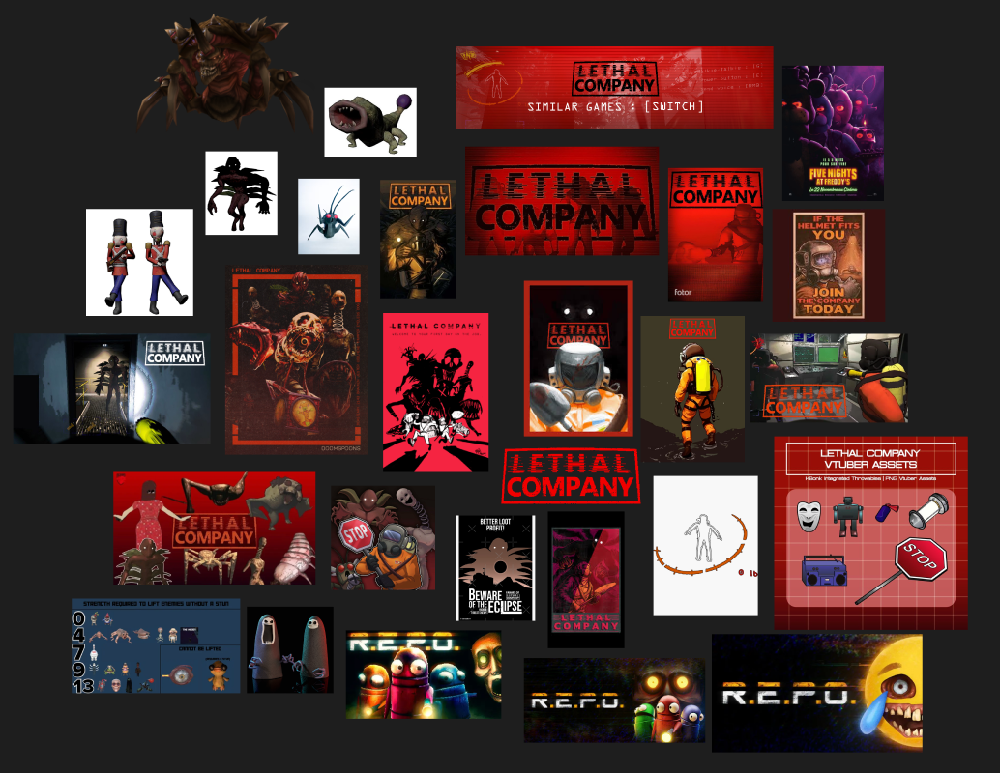

# creative_developement

## Collaborators
- [Pierric Letard](https://github.com/Mrpierrouge)
- [Quentin Garnier](https://github.com/F1N3X)

## How to run the project
1. Clone the repository:
    ```bash
    git clone https://github.com/Mrpierrouge/creative_developement.git
    cd creative_development
    ```
2. Install the LiveServer extension in Visual Studio Code.
3. Open the project in Visual Studio Code.
4. Start the LiveServer to see the project in action.

## Project Structure
- `index.html`: The main HTML file.
- `style.css`: The main CSS file for styling the project.
- `script.js`: The main JavaScript file for interactivity.
- `assets/`: Directory containing images and other assets used in the project.
- `README.md`: This file, providing an overview of the project.

## Moodboard


## Concept explanation
This movie poster for Lethal Company is designed to capture the essence of a horror survival film. It uses dark, eerie colors and graphic elements that create a sense of tension and danger. The film title stands out with bold, glitchy text, while the background shows scenes full of suspense with fading monsters.